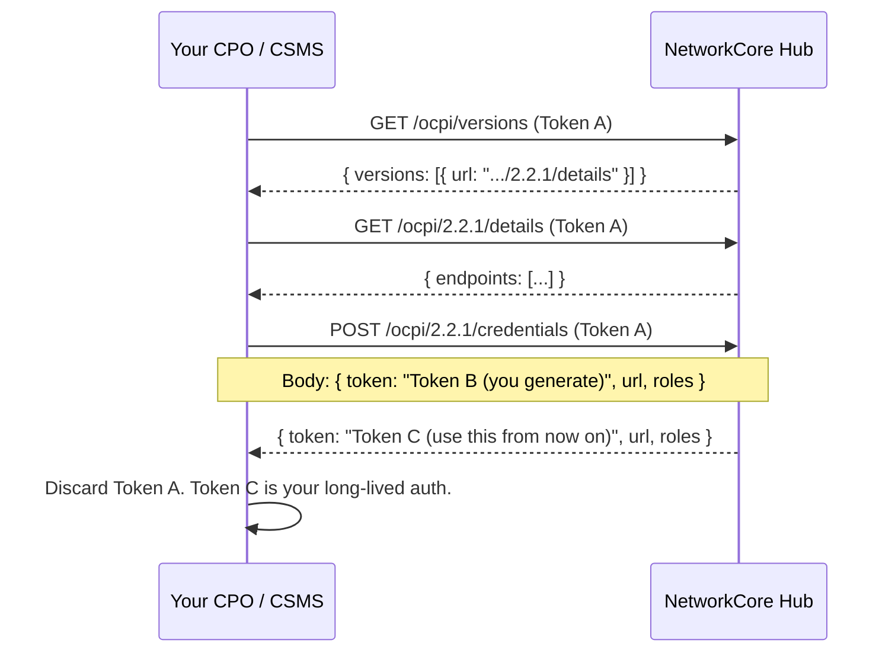

# OCPI 2.2.1 Integration

NetworkCore exposes a spec-compliant **OCPI 2.2.1 hub**. CPOs and CSMS implement
the OCPI sender side; the hub stores, validates, and forwards to subscribed
Distribution Partners. The financial layer underneath (clearing, settlement,
chargebacks) is NetworkCore's own — OCPI deliberately leaves the money out.

:::tip Same surface for CPOs and CSMS
The OCPI integration is identical whether you run a single CPO or a CSMS
hosting many CPOs. CSMS partners just register each underlying CPO as its own
`(country_code, party_id)` and complete one handshake per CPO. See the
[Multi-CPO / CSMS setup](/ev-charging/charging-software/multi-cpo-csms-setup)
page for the multi-tenant pattern.
:::

## 1. Overview

### Roles

| Role | What you push | What you receive |
|---|---|---|
| **CPO** (operator of physical chargers) | Locations, EVSEs, connectors, sessions, CDRs, tariffs | Driver tokens, remote commands |
| **CSMS** (platform serving multiple CPOs) | Same as CPO — one stream per underlying CPO `party_id` | Same as CPO, routed per `party_id` |

### Supported driver authentication methods

The hub accepts every authentication method OCPI 2.2.1 specifies:

- **AD_HOC_USER** — driver pays per session at the charger UI (typical for one-off web payments)
- **APP_USER** — driver authenticated via a DP's app (the common roaming case)
- **AUTH_REQUEST** — driver authenticates via OCPP `Authorize` to the CSMS, which then asks the hub
- **OTHER** — non-standard methods (RFID-only, etc.) — flagged for review

## 2. Endpoints & modules

OCPI 2.2.1 modules implemented by the hub:

| Module | Sender (you push) | Receiver (you pull) | URL pattern |
|---|---|---|---|
| **Versions**     | — | discovery | `GET /ocpi/versions` |
| **Credentials**  | both | both | `/ocpi/2.2.1/credentials` |
| **Locations**    | CPO → hub | hub → DP | `/ocpi/2.2.1/cpo/locations/{cc}/{party_id}/{location_id}` |
| **Sessions**     | CPO → hub | hub → DP | `/ocpi/2.2.1/cpo/sessions/{cc}/{party_id}/{session_id}` |
| **CDRs**         | CPO → hub | DP, hub → DP | `POST /ocpi/2.2.1/cpo/cdrs` |
| **Tariffs**      | CPO → hub | DP, hub → DP | `/ocpi/2.2.1/cpo/tariffs/{cc}/{party_id}/{tariff_id}` |
| **Tokens**       | DP → hub | CPO authorisation requests | `/ocpi/2.2.1/emsp/tokens/{cc}/{party_id}/{token_uid}` |
| **Commands**     | DP → hub | CPO acks the result | `POST /ocpi/2.2.1/cpo/commands/{command}` |

Full endpoint reference under [API Reference](/api-reference).

## 3. Handshake (registration)

The OCPI handshake is a one-time credentials exchange that establishes a long-lived **Token C** for ongoing communication.



### Step-by-step

1. **Receive Token A** from NetworkCore operations during onboarding. This is a one-time-use token, expires after first use.
2. **GET `/ocpi/versions`** with `Authorization: Token <Token A>` to discover supported OCPI versions.
3. **GET `/ocpi/2.2.1/details`** to receive the list of available endpoints for that version.
4. **POST `/ocpi/2.2.1/credentials`** with a body containing **your** Token B (which the hub will use to call you), your versions URL, and your role(s).
5. The hub responds with **Token C** — your long-lived auth token. Store it securely; use it on every subsequent request.

After handshake, Token A is dead. If you lose Token C, NetworkCore must issue a new Token A and you restart the handshake.

## 4. Authorization headers

Every authenticated OCPI request must include:

```http
Authorization: Token <Token C>
X-Request-ID: <unique per request, you generate>
X-Correlation-ID: <traces a logical flow across multiple requests>
OCPI-from-country-code: <your country, e.g. MX>
OCPI-from-party-id:     <your 3-char party id, e.g. VOL>
OCPI-to-country-code:   <hub country, NetworkCore uses CH>
OCPI-to-party-id:       NCR
```

The `X-Request-ID` and `X-Correlation-ID` are echoed back on every response — the hub mirrors them for cross-system traceability.

:::info Why "optional today" on the OCPI-from/to-* headers?
This hub currently terminates calls itself rather than forwarding them between parties, so the routing context isn't strictly needed. We accept and log them when present, and may tighten validation in a future release. Senders that follow the spec strictly will not notice a difference.
:::

## 5. Example flows — CPO push side

The CPO push examples are below. For the DP pull-side equivalents (location catalogue sync, session monitoring, CDR pulls, remote start), see the [Distribution Partner guide](/ev-charging/distribution-partners/handshake).

### 5.1 Push a location

```http
PUT /ocpi/2.2.1/cpo/locations/MX/CPX/LOC001
Authorization: Token TOKEN_C
X-Request-ID: 7c5a2c92-3b4f-4e1c-9c4d-1e7b9c2a3a40
X-Correlation-ID: 7c5a2c92-3b4f-4e1c-9c4d-1e7b9c2a3a40
Content-Type: application/json
```

```json
{
  "id":           "LOC001",
  "country_code": "MX",
  "party_id":     "CPX",
  "publish":      true,
  "name":         "Example CPO Site #1",
  "address":      "Av. Example 123",
  "city":         "Mexico City",
  "country":      "MEX",
  "coordinates":  { "latitude": "19.4326", "longitude": "-99.1900" },
  "time_zone":    "America/Mexico_City",
  "evses": [
    {
      "uid":    "LOC001-EVSE-1",
      "status": "AVAILABLE",
      "connectors": [
        {
          "id":           "1",
          "standard":     "IEC_62196_T1_COMBO",
          "format":       "CABLE",
          "power_type":   "DC",
          "max_voltage":  400,
          "max_amperage": 125,
          "tariff_ids":   ["TARIFF-DEFAULT"],
          "last_updated": "2026-04-29T12:00:00Z"
        }
      ],
      "last_updated": "2026-04-29T12:00:00Z"
    }
  ],
  "last_updated": "2026-04-29T12:00:00Z"
}
```

**Response** — `HTTP 200`:

```json
{ "status_code": 1000, "data": null, "timestamp": "2026-04-29T12:00:01Z" }
```

### 5.2 Push a session start

```http
PUT /ocpi/2.2.1/cpo/sessions/MX/CPX/S1234
Authorization: Token TOKEN_C
X-Request-ID: 8d6b3da1-4c50-4f2d-9d5e-2f8c0d3b4b51
X-Correlation-ID: 8d6b3da1-4c50-4f2d-9d5e-2f8c0d3b4b51
Content-Type: application/json
```

```json
{
  "id":              "S1234",
  "country_code":    "MX",
  "party_id":        "CPX",
  "start_date_time": "2026-04-29T10:15:00Z",
  "kwh":             0,
  "cdr_token": {
    "country_code": "MX",
    "party_id":     "EMP",
    "uid":          "5b1f8e1f-c0e3-4a8b-95a8-2d5f8e9c1aaa",
    "type":         "APP_USER",
    "contract_id":  "MX-EMP-CONTRACT-12345"
  },
  "auth_method":  "AUTH_REQUEST",
  "location_id":  "LOC001",
  "evse_uid":     "LOC001-EVSE-1",
  "connector_id": "1",
  "currency":     "MXN",
  "status":       "ACTIVE",
  "last_updated": "2026-04-29T10:15:00Z"
}
```

Update the same session URL (`PUT`) periodically with new `kwh` + `last_updated` values to drive live progress in the DP's app. Once finalised, set `status: "COMPLETED"`.

### 5.3 Post a CDR (final billing record)

CDRs are the immutable settlement-of-record. **The hub clears off the CDR**, not off the session — sessions can be re-pushed and corrected, CDRs cannot.

```http
POST /ocpi/2.2.1/cpo/cdrs
Authorization: Token TOKEN_C
X-Request-ID: 9e7c4eb2-5d61-4a3e-ae6f-3a9d1e4c5c62
X-Correlation-ID: 9e7c4eb2-5d61-4a3e-ae6f-3a9d1e4c5c62
Content-Type: application/json
```

```json
{
  "id":              "CDR-S1234",
  "country_code":    "MX",
  "party_id":        "CPX",
  "start_date_time": "2026-04-29T10:15:00Z",
  "end_date_time":   "2026-04-29T11:00:00Z",
  "session_id":      "S1234",
  "cdr_token": {
    "country_code": "MX",
    "party_id":     "EMP",
    "uid":          "5b1f8e1f-c0e3-4a8b-95a8-2d5f8e9c1aaa",
    "type":         "APP_USER",
    "contract_id":  "MX-EMP-CONTRACT-12345"
  },
  "auth_method":  "AUTH_REQUEST",
  "cdr_location": {
    "id":           "LOC001",
    "address":      "Av. Example 123",
    "city":         "Mexico City",
    "country":      "MEX",
    "coordinates":  { "latitude": "19.4326", "longitude": "-99.1900" },
    "evse_uid":     "LOC001-EVSE-1",
    "connector_id": "1",
    "connector_standard":   "IEC_62196_T1_COMBO",
    "connector_format":     "CABLE",
    "connector_power_type": "DC"
  },
  "currency":     "MXN",
  "charging_periods": [
    {
      "start_date_time": "2026-04-29T10:15:00Z",
      "dimensions": [
        { "type": "ENERGY", "volume": 25.0 },
        { "type": "TIME",   "volume": 0.75 }
      ]
    }
  ],
  "total_cost":   { "excl_vat": 162.50, "incl_vat": 188.50 },
  "total_energy": 25.0,
  "total_time":   0.75,
  "last_updated": "2026-04-29T11:00:01Z"
}
```

:::tip CDR triggers financial clearing
As soon as the hub validates the CDR against the locked tariff, it computes
CPO / DP / NetworkCore splits and queues the settlement payout on the rail
configured for the party's operating currency (CLABE for MXN, IBAN for EUR/CHF,
ACH for USD, etc.). See [Settlement & payouts](/ev-charging/charging-software/settlement).
:::

## 6. Error responses

All OCPI responses — including errors — follow the standard envelope:

```json
{
  "status_code":    2001,
  "status_message": "Invalid CDR — total_cost.excl_vat is required",
  "timestamp":      "2026-04-29T12:34:56Z"
}
```

### OCPI status codes returned by this hub

| Code | Meaning | Common cause |
|---|---|---|
| `1000` | Success | — |
| `2001` | Invalid or missing parameters | Required field missing or wrong type. Validation failures collapse into this code rather than the spec's `2000` generic |
| `2002` | Not enough information | Mostly happens during credentials registration when the body is incomplete |
| `2003` | Unknown location | Pushed a CDR or session referencing a `location_id` the hub has never seen |
| `2004` | Unknown token | Token UID referenced in a session or CDR is not registered with the hub |
| `3000` | Generic server error | Auth failures and unhandled exceptions both surface here. The `status_message` tells you which |
| `3001` | Unable to use the client's API | The hub tried to call your endpoint (e.g. during handshake) and it failed |
| `3002` | Unsupported version | Send 2.2.1 — no 2.1.1 / 2.2 fallback |
| `3003` | No matching endpoints | Check the module URL pattern table above |

### HTTP status semantics

Per OCPI 2.2.1 spec, almost every response — including auth failures and validation errors — is delivered as **HTTP 200** with the failure detail inside the OCPI envelope. Always inspect `status_code` rather than the HTTP status alone.

| HTTP | When |
|---|---|
| `200` | Request reached the hub and was processed. Inspect `status_code` in the body for OCPI-level outcome (`1000` success, `2xxx` client error, `3xxx` server error) |
| `404` | Unknown OCPI route (typo in path or undocumented module). Returns a generic JSON error, not an OCPI envelope |
| `422` | PAN-shaped data detected in payload (mechanism #13 — network tokens, no PAN) |
| `429` | Rate limited. The hub allows 500 requests per minute per source IP across all `/ocpi/*` endpoints, sliding window |
| `5xx` | Hub-side incident. Retry with exponential backoff — push endpoints are idempotent on `(country_code, party_id, id)` keys |

:::info Auth failures also return HTTP 200
Missing header, unknown token, or suspended party all return **HTTP 200** with `status_code: 3000` — per OCPI spec. Always look at the body envelope, not just the HTTP code.
:::

## 7. Testing & sandbox

The hub runs an identical sandbox with `MOCK_INTEGRATIONS=true` — all
external integrations (SDK.finance, STP, FacturAPI) return canned responses.
Real session data, real CDR shapes, no real money moves.

See the [Sandbox page](/sandbox) for test credentials, the Postman
collection, and the demo seed.

## 8. Support

- **Technical issues**: [partner@networkcore.org](mailto:partner@networkcore.org)
- **Open an issue** on the [docs repo](https://github.com/NetworkCoreAG/networkcore-docs/issues) if something here is wrong
- **Self-service**: partner portal at [hub.networkcore.org/partner/ui](https://hub.networkcore.org/partner/ui/)
