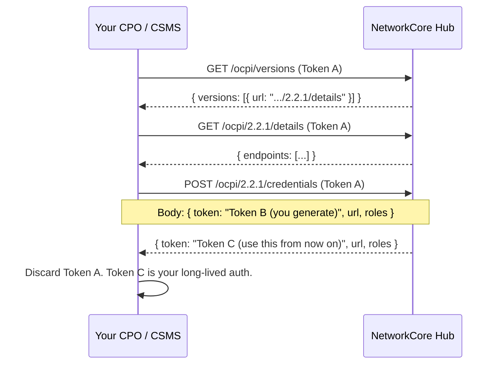

# OCPI 2.2.1 Integration

NetworkCore exposes a spec-compliant **OCPI 2.2.1 hub**. CPOs and CSMS implement
the OCPI sender side; the hub stores, validates, and forwards to subscribed
Distribution Partners. The financial layer underneath (clearing, settlement,
chargebacks) is NetworkCore's own — OCPI deliberately leaves the money out.

:::tip Same surface for CPOs and CSMS
The OCPI integration is identical whether you run a single CPO or a CSMS
hosting many CPOs. CSMS partners just register each underlying CPO as its own
`(country_code, party_id)` and complete one handshake per CPO. See the
[Multi-CPO / CSMS setup](/ev-charging/charging-software/multi-cpo-csms-setup)
page for the multi-tenant pattern.
:::

## 1. Overview

### Roles

| Role | What you push | What you receive |
|---|---|---|
| **CPO** (operator of physical chargers) | Locations, EVSEs, connectors, sessions, CDRs, tariffs | Driver tokens, remote commands |
| **CSMS** (platform serving multiple CPOs) | Same as CPO — one stream per underlying CPO `party_id` | Same as CPO, routed per `party_id` |

### Supported driver authentication methods

The hub accepts every authentication method OCPI 2.2.1 specifies:

- **AD_HOC_USER** — driver pays per session at the charger UI (typical for one-off web payments)
- **APP_USER** — driver authenticated via a DP's app (the common roaming case)
- **AUTH_REQUEST** — driver authenticates via OCPP `Authorize` to the CSMS, which then asks the hub
- **OTHER** — non-standard methods (RFID-only, etc.) — flagged for review

## 2. Endpoints & modules

OCPI 2.2.1 modules implemented by the hub:

| Module | Sender (you push) | Receiver (you pull) |
|---|---|---|
| **Locations** | CPO → hub | DP, hub → DP |
| **Sessions** | CPO → hub | DP, hub → DP |
| **CDRs** | CPO → hub | DP, hub → DP |
| **Tariffs** | CPO → hub | DP, hub → DP |
| **Tokens** | DP → hub | CPO authorisation requests |
| **Commands** | DP → hub | CPO acks the result |
| **Credentials** | both directions during handshake | — |
| **Versions** | discovery endpoint | — |

Full endpoint reference under [API Reference](/api-reference/).

## 3. Handshake (registration)

The OCPI handshake is a one-time credentials exchange that establishes a long-lived **Token C** for ongoing communication.



### Step-by-step

1. **Receive Token A** from NetworkCore operations during onboarding. This is a one-time-use token, expires after first use.
2. **GET `/ocpi/versions`** with `Authorization: Token <Token A>` to discover supported OCPI versions.
3. **GET `/ocpi/2.2.1/details`** to receive the list of available endpoints for that version.
4. **POST `/ocpi/2.2.1/credentials`** with a body containing **your** Token B (which the hub will use to call you), your versions URL, and your role(s).
5. The hub responds with **Token C** — your long-lived auth token. Store it securely; use it on every subsequent request.

After handshake, Token A is dead. If you lose Token C, NetworkCore must issue a new Token A and you restart the handshake.

## 4. Authorization headers

Every authenticated OCPI request must include:

```http
Authorization: Token <Token C>
X-Request-ID: <unique per request, you generate>
X-Correlation-ID: <traces a logical flow across multiple requests>
OCPI-from-country-code: <your country, e.g. MX>
OCPI-from-party-id:     <your 3-char party id, e.g. VOL>
OCPI-to-country-code:   <hub country, NetworkCore uses CH>
OCPI-to-party-id:       NCR
```

The `X-Request-ID` and `X-Correlation-ID` are echoed back on every response — the hub mirrors them for cross-system traceability.

## 5. Example flows

The flows split by who's pushing and who's pulling:

### CPO push-side flows

These are the bread and butter of a CPO/CSMS integration:

- **Push a location** — onboarding a new site
- **Push a session start** — driver plugged in, charge began
- **Push a session update** — periodic kWh updates during charging
- **Post a CDR** — the immutable billing record once the session ends
- **Push a tariff** — your pricing rules

:::info Coming soon
Worked examples (curl + payload schemas) for each CPO push flow are being
migrated from the existing hub integration guide. In the meantime, the
[live integration guide on hub.networkcore.org](https://hub.networkcore.org/docs/ocpi-integration.html#examples)
covers all five with complete examples.
:::

### DP pull-side flows

If you're a Distribution Partner, see the
[DP integration guide](/ev-charging/distribution-partners/handshake) for the
pull-side examples (location catalogue sync, session monitoring, CDR pulls,
remote start).

## 6. Error responses

OCPI uses a soft-error envelope: HTTP 200 with a `status_code` in the body.

```json
{
  "status_code": 2001,
  "status_message": "Invalid or missing parameters",
  "timestamp": "2026-05-22T08:30:00.000Z",
  "data": null
}
```

| Status code | Meaning |
|---|---|
| `1000` | Success |
| `2000` | Generic client error |
| `2001` | Invalid or missing parameters |
| `2002` | Not enough information |
| `2003` | Unknown location |
| `2004` | Unknown EVSE |
| `3000` | Generic server error |
| `3001` | Unable to use the OCPI client to push update |
| `3002` | Unsupported version |
| `3003` | No matching endpoints |

A handful of conditions return regular HTTP status codes instead:

| Status | Cause |
|---|---|
| `401` | Token A/C missing or invalid |
| `404` | Unknown URL |
| `422` | PAN-shaped data detected in payload (mechanism #13 — network tokens, no PAN) |
| `429` | Rate limit exceeded |
| `503` | Hub overloaded or briefly unavailable |

## 7. Testing & sandbox

The sandbox runs the same code with `MOCK_INTEGRATIONS=true` — all external
integrations (SDK.finance, STP, FacturAPI) return canned responses. Real
session data, real CDR shapes, no real money moves.

See [Sandbox](/sandbox) for test credentials + the Postman collection.

## 8. Support

- **Technical issues**: `partner@networkcore.org`
- **Open an issue** on the [docs repo](https://github.com/NetworkCoreAG/networkcore-docs/issues) if something here is wrong
- **Self-service**: partner portal at [hub.networkcore.org/partner/ui](https://hub.networkcore.org/partner/ui/)

---

:::note Migration status
This page is the new home for the OCPI integration guide. The legacy guide
at [hub.networkcore.org/docs/ocpi-integration.html](https://hub.networkcore.org/docs/ocpi-integration.html)
remains live during the transition. Once this MDX version has worked-example
parity, the legacy URL will 301-redirect here.
:::
