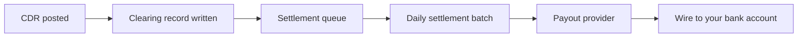

# Settlement & payouts

Once a CDR clears, the cleared amount enters the settlement queue. The hub
batches per-(party, currency) per period and runs a payout via the rail
configured for your operating currency.

## How it works



1. CDR posted → tariff validated, clearing record written with CPO/DP/NC splits
2. Settlement batch created daily per (party, currency)
3. Hub calls the payout provider configured for that currency
4. Funds arrive in your bank account (settlement time depends on rail)

## Supported rails

| Currency | Rail | Provider | Typical T+ |
|---|---|---|---|
| MXN | CLABE / SPEI | STP.mx | T+0 (same day) |
| EUR | IBAN / SEPA | (provider TBD per partner) | T+1 to T+2 |
| USD | ACH | (provider TBD per partner) | T+2 |
| GBP | FPS_UK | (provider TBD per partner) | T+0 |
| BRL | PIX_BR | (provider TBD per partner) | T+0 |
| CAD | EFT_CA | (provider TBD per partner) | T+1 |

Per-provider env-var-triggered live/mock switching means going live with a
new rail is a single-file edit + env var set on the hub side, no router
changes for you.

## The `session.settled` webhook

The hub POSTs this to you the moment a session is cleared:

```json
{
  "event":           "session.settled",
  "session_id":      "internal-uuid",
  "ocpi_session_id": "S1234",
  "cpo_party_id":    "uuid",
  "cpo_name":        "Your CPO",
  "gross_amount":    188.50,
  "cpo_amount":      169.65,
  "dp_amount":       9.42,
  "nc_amount":       9.43,
  "energy_kwh":      25.0,
  "currency":        "MXN",
  "settled_at":      "2026-04-29T11:00:05Z",
  "invoices": {
    "customer_uuid":     "cfdi-uuid",
    "customer_pdf_url":  "https://...",
    "commission_uuid":   "cfdi-uuid",
    "revenue_share_uuid": "cfdi-uuid"
  }
}
```

Subscribe via the [partner integrations page](https://hub.networkcore.org/partner/ui/) → Integrations → Add Webhook.

## Rolling reserves

NetworkCore holds a per-CPO rolling reserve to protect against chargebacks.
Reserve % is driven by the DP risk tier (`LOW`, `STANDARD`, `ELEVATED`, `HIGH`)
on your finance config:

| Tier | Reserve % | Window |
|---|---|---|
| LOW | 2% | 30 days |
| STANDARD | 5% | 90 days |
| ELEVATED | 10% | 120 days |
| HIGH | 15% | 180 days |

Released reserves get added to the next settlement batch automatically.

## First-loss envelope

On top of reserves, NetworkCore absorbs the **first 1% of chargeback losses**
per CPO per year via the [first-loss envelope](/guides/first-loss-envelope).
You see the envelope balance in your partner portal's wallet card.
