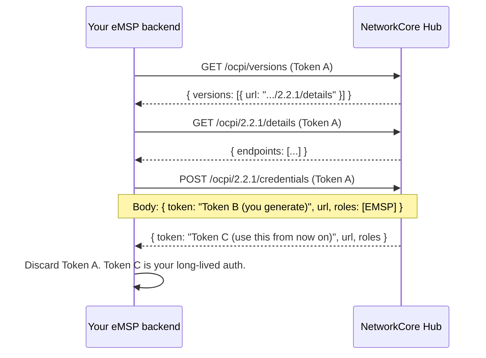

# OCPI eMSP handshake

The OCPI handshake is the same on the eMSP side as on the CPO side — a
one-time credentials exchange that establishes a long-lived **Token C** for
ongoing communication.



## Step-by-step

1. **Receive Token A** from NetworkCore operations during onboarding. One-time-use, expires after first use.
2. **GET `/ocpi/versions`** with `Authorization: Token <Token A>` to discover supported OCPI versions.
3. **GET `/ocpi/2.2.1/details`** to receive the list of available endpoints.
4. **POST `/ocpi/2.2.1/credentials`** with your Token B (which the hub will use to call you), your versions URL, and `roles: [{role: "EMSP", ...}]`.
5. The hub responds with **Token C**. Store it securely; use it on every subsequent request.

## Authorization headers

Every authenticated OCPI request must include:

```http
Authorization: Token <Token C>
X-Request-ID: <unique per request, you generate>
X-Correlation-ID: <traces a logical flow>
OCPI-from-country-code: <your country, e.g. MX>
OCPI-from-party-id:     <your 3-char party id, e.g. EMP>
OCPI-to-country-code:   CH
OCPI-to-party-id:       NCR
```

## Next steps

Once the handshake is done, you can start consuming the modules:

- **[Pull locations](/ev-charging/distribution-partners/locations)** — initial catalogue sync + incremental updates
- **[Push driver tokens](/ev-charging/distribution-partners/tokens)** — issue + sync to the roaming network
- **[Remote start / stop](/ev-charging/distribution-partners/commands)** — kick off sessions from your app
- **[Reconciliation](/ev-charging/distribution-partners/reconciliation)** — pull sessions + CDRs for your books
