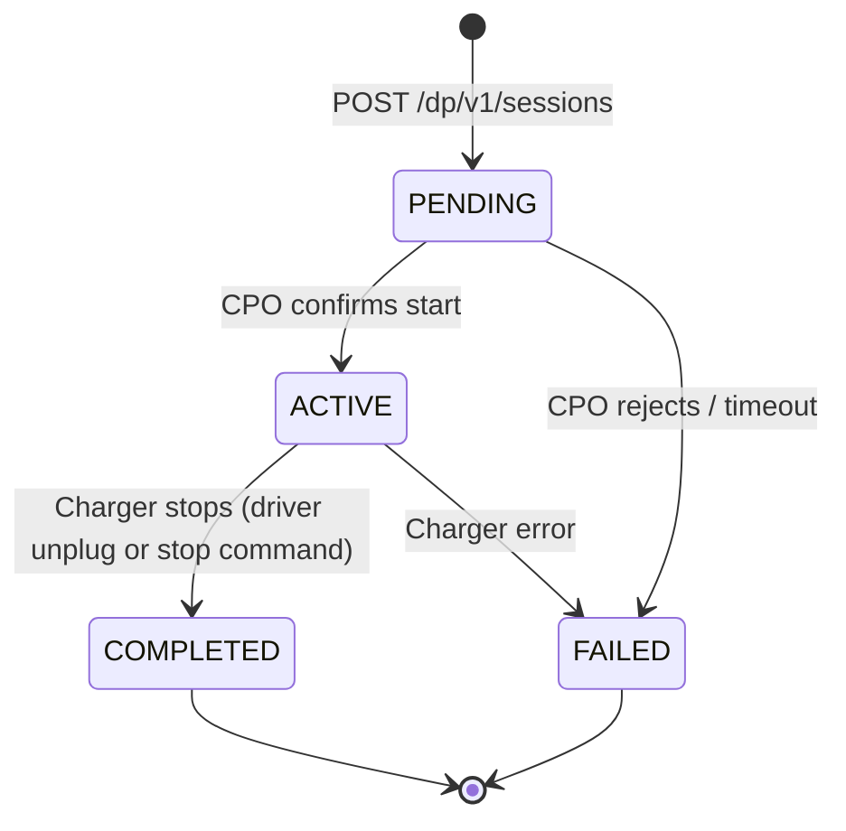

# Sessions

When a driver taps "Start charging" in your app, your backend calls the hub to
start a session. The hub handles OCPI routing to the CPO internally — you never
touch the protocol.

## Start a session

```http
POST /dp/v1/sessions
Authorization: Bearer <your_dp_api_key>
Content-Type: application/json
X-Request-ID: e2c5f1a7-a2b6-4f91-f3c4-8f3b6c919a0b
```

```json
{
  "reference":       "your-order-123",
  "location_id":     "LOC001",
  "charge_point_id": "LOC001-CP-1",
  "connector_id":    "1",
  "driver_ref":      "driver-456"
}
```

| Field | Type | Required | Description |
|---|---|---|---|
| `reference` | string | yes | Your own order/session reference for correlation |
| `location_id` | string | yes | Location from the [locations catalogue](/ev-charging/distribution-partners/locations) |
| `charge_point_id` | string | yes | Charge point within the location |
| `connector_id` | string | yes | Connector on the charge point |
| `driver_ref` | string | no | Opaque driver identifier for your records |

**Response** — `HTTP 201`:

```json
{
  "data": {
    "id":               "a1b2c3d4-e5f6-7890-abcd-ef1234567890",
    "reference":        "your-order-123",
    "status":           "PENDING",
    "location_id":      "LOC001",
    "charge_point_id":  "LOC001-CP-1",
    "connector_id":     "1",
    "start_time":       null,
    "end_time":         null,
    "kwh":              0,
    "currency":         "MXN",
    "total_cost":       null,
    "created_at":       "2026-04-29T10:14:50Z",
    "updated_at":       "2026-04-29T10:14:50Z"
  }
}
```

The session starts in `PENDING` while the hub routes the start command to the
CPO. Subscribe to the [`session.updated` webhook](/webhooks/events) or poll
`GET /dp/v1/sessions/{id}` to track progress.

## List sessions

```http
GET /dp/v1/sessions?status=ACTIVE&limit=50&offset=0
Authorization: Bearer <your_dp_api_key>
X-Request-ID: c0a3d9e5-8094-4d6f-d1a2-6d1f4a7f8f95
```

| Parameter | Type | Default | Description |
|---|---|---|---|
| `status` | string | — | Filter by status: `PENDING`, `ACTIVE`, `COMPLETED`, `FAILED` |
| `updated_since` | ISO 8601 | — | Only sessions updated after this timestamp |
| `limit` | integer | 50 | Page size (max 1000) |
| `offset` | integer | 0 | Number of records to skip |

**Response** — `HTTP 200`:

```json
{
  "data": [
    {
      "id":               "a1b2c3d4-e5f6-7890-abcd-ef1234567890",
      "reference":        "your-order-123",
      "status":           "ACTIVE",
      "location_id":      "LOC001",
      "charge_point_id":  "LOC001-CP-1",
      "connector_id":     "1",
      "start_time":       "2026-04-29T10:15:00Z",
      "end_time":         null,
      "kwh":              12.4,
      "currency":         "MXN",
      "total_cost":       null,
      "created_at":       "2026-04-29T10:14:50Z",
      "updated_at":       "2026-04-29T10:33:00Z"
    }
  ],
  "total_count": 1,
  "limit": 50,
  "offset": 0
}
```

## Get a single session

```http
GET /dp/v1/sessions/a1b2c3d4-e5f6-7890-abcd-ef1234567890
Authorization: Bearer <your_dp_api_key>
X-Request-ID: d1b4e0f6-91a5-4e80-e2b3-7e2a5b80909a
```

Returns the same session object as above, unwrapped:

```json
{
  "data": {
    "id":               "a1b2c3d4-e5f6-7890-abcd-ef1234567890",
    "reference":        "your-order-123",
    "status":           "ACTIVE",
    "location_id":      "LOC001",
    "charge_point_id":  "LOC001-CP-1",
    "connector_id":     "1",
    "start_time":       "2026-04-29T10:15:00Z",
    "end_time":         null,
    "kwh":              12.4,
    "currency":         "MXN",
    "total_cost":       null,
    "created_at":       "2026-04-29T10:14:50Z",
    "updated_at":       "2026-04-29T10:33:00Z"
  }
}
```

## Stop a session

```http
POST /dp/v1/sessions/a1b2c3d4-e5f6-7890-abcd-ef1234567890/stop
Authorization: Bearer <your_dp_api_key>
X-Request-ID: f2c5a1b7-b3c6-4091-a4d5-9a4c7d020b1c
```

No request body required. The hub sends a stop command to the CPO.

**Response** — `HTTP 200`:

```json
{
  "data": {
    "id":               "a1b2c3d4-e5f6-7890-abcd-ef1234567890",
    "reference":        "your-order-123",
    "status":           "ACTIVE",
    "location_id":      "LOC001",
    "charge_point_id":  "LOC001-CP-1",
    "connector_id":     "1",
    "start_time":       "2026-04-29T10:15:00Z",
    "end_time":         null,
    "kwh":              25.0,
    "currency":         "MXN",
    "total_cost":       null,
    "created_at":       "2026-04-29T10:14:50Z",
    "updated_at":       "2026-04-29T11:00:00Z"
  }
}
```

:::info Async deactivation
The stop command is asynchronous. The session remains `ACTIVE` until the CPO
confirms the charger has stopped. Once confirmed, the session transitions to
`COMPLETED` with `end_time`, final `kwh`, and `total_cost` populated. Track
this via the [`session.updated` webhook](/webhooks/events) or by polling.
:::

## Session lifecycle



| Status | Meaning |
|---|---|
| `PENDING` | Start command sent to CPO, awaiting confirmation |
| `ACTIVE` | Charger is energized, kWh accruing |
| `COMPLETED` | Session finished — `end_time`, `kwh`, and `total_cost` are final |
| `FAILED` | Session could not start or was interrupted by a charger fault |

## Error responses

| HTTP | Error code | Meaning |
|---|---|---|
| `404` | `LOCATION_NOT_FOUND` | The `location_id` does not exist in the catalogue |
| `404` | `CHARGE_POINT_NOT_FOUND` | The `charge_point_id` is not at this location |
| `404` | `CONNECTOR_NOT_FOUND` | The `connector_id` is not on this charge point |
| `404` | `SESSION_NOT_FOUND` | No session with this ID exists |
| `409` | `CHARGE_POINT_OCCUPIED` | Another session is already active on this charge point |
| `409` | `CHARGE_POINT_OUT_OF_SERVICE` | The charge point is faulted or offline |
| `422` | `MISSING_FIELD` | A required field is missing from the request body |
| `409` | `SESSION_NOT_ACTIVE` | Cannot stop a session that is not `ACTIVE` |

Error responses follow the standard envelope:

```json
{
  "error": {
    "code":    "CHARGE_POINT_OCCUPIED",
    "message": "Charge point LOC001-CP-1 already has an active session."
  }
}
```

## Session schema reference

| Field | Type | Description |
|---|---|---|
| `id` | UUID | Assigned by NetworkCore |
| `reference` | string | Your reference from the start request |
| `status` | string | `PENDING` &#124; `ACTIVE` &#124; `COMPLETED` &#124; `FAILED` |
| `location_id` | string | Location where the session is happening |
| `charge_point_id` | string | Charge point within the location |
| `connector_id` | string | Connector on the charge point |
| `start_time` | ISO 8601 &#124; null | When the charger started delivering energy |
| `end_time` | ISO 8601 &#124; null | When the charger stopped |
| `kwh` | number | Energy delivered so far (updated periodically during `ACTIVE`) |
| `currency` | ISO 4217 | Currency for `total_cost` |
| `total_cost` | number &#124; null | Final cost, set when status is `COMPLETED` |
| `created_at` | ISO 8601 | When the session was created |
| `updated_at` | ISO 8601 | Last update timestamp |

## Webhooks

Subscribe to session webhooks to get real-time updates instead of polling:

- **`session.updated`** — fires on every status change and periodic kWh updates
- **`session.settled`** — fires when the financial clearing for the session is complete

See [Webhook events](/webhooks/events) for payload shapes and delivery guarantees.
