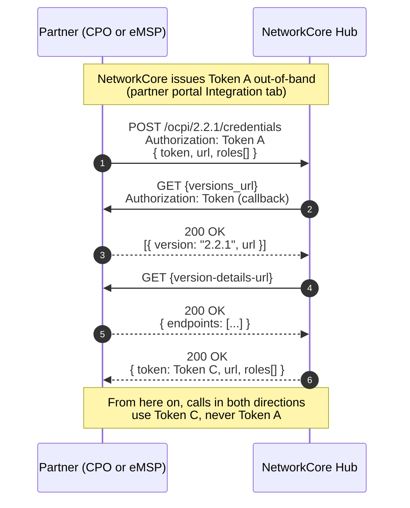
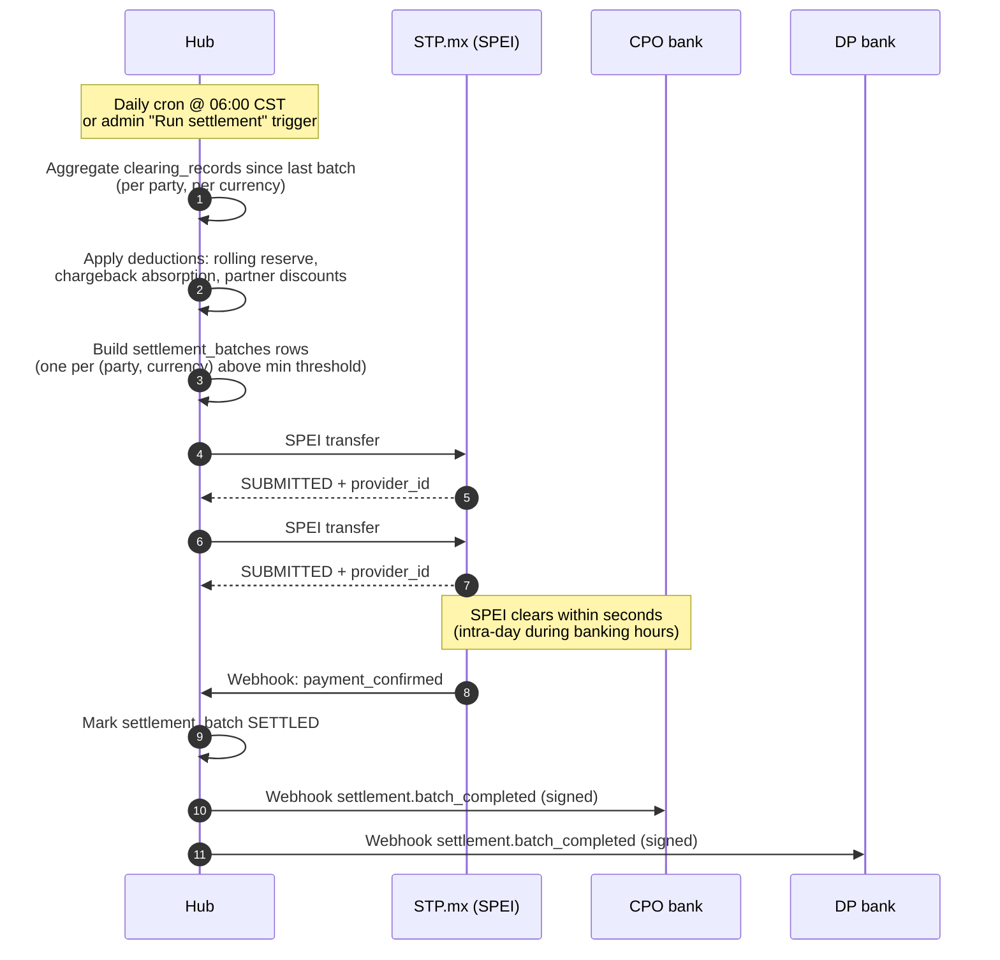
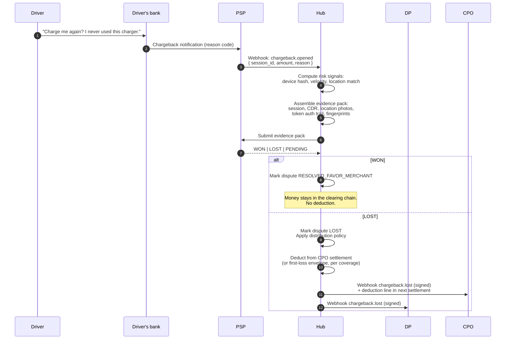

# Reference architecture

The hub sits between a CPO (or CSMS like AMPECO running multiple CPOs) and
a Distribution Partner (DP / eMSP). The CPO publishes locations and
tariffs; drivers reach those chargers through the DP's app; sessions and
CDRs flow back to the hub which validates, clears, invoices, and settles.

This page walks the four flows that matter for a real live session:
**handshake**, **session lifecycle**, **settlement**, and **dispute**.
Each diagram is the contract — if your integration matches it, you're done.

## 1. OCPI handshake (one-time per party)

Both sides exchange tokens and discover each other's endpoints. The
handshake runs once per partner; after that, calls flow with the issued
Token C.



**What goes wrong:**

| Symptom | Cause |
|---|---|
| `3001 Unable to use the client's API` with "DNS unresolved" | Your `versions_url` host doesn't resolve from our network |
| `3001` with "Connection refused" | Firewall blocking inbound from `hub.networkcore.org` |
| `3001` with "TLS handshake failed" | Self-signed cert — use a public CA |
| `3001` with "Partner rejected the token Hub used" | The `token` field in your POST must be what NetworkCore uses to call you, not what you use to call us |
| `3002 Unsupported version` | We only support 2.2.1 today; 2.3 is on the roadmap |

The partner portal's **Test connection** button reproduces step 3 above without committing — use it before you submit credentials.

## 2. Session lifecycle

A driver plugs in, energy flows, the session closes, a CDR lands, and the
hub clears it. Below shows the eMSP-routed flow (driver auth via DP token);
direct-pay flows are similar but skip steps 2-4.

```mermaid
sequenceDiagram
  autonumber
  participant D as Driver
  participant DP as DP (eMSP)
  participant H as Hub
  participant CPO as CPO (CSMS)
  D->>DP: Open app, tap "Start"
  DP->>H: POST /ocpi/2.2.1/cpo/commands/START_SESSION<br/>{ token, location_id, evse_uid, ... }
  H->>CPO: Forward command to CPO endpoint
  CPO-->>H: ACCEPTED + session_id
  H-->>DP: ACCEPTED + session_id
  Note over CPO: Charger energizes;<br/>CPO PUSHes session updates as kWh accrues
  CPO->>H: PUT /ocpi/2.2.1/cpo/sessions/.../{id}<br/>status: ACTIVE, kwh accumulating
  H->>DP: GET-able / webhook session.updated
  Note over D,CPO: Driver unplugs
  CPO->>H: PUT .../{id} status: COMPLETED, total_energy_kwh, total_cost
  CPO->>H: POST /ocpi/2.2.1/cpo/cdrs<br/>{ session_id, total_cost, line_items, ... }
  H->>H: Validate tariff lock, recompute cost,<br/>flag held vs passed
  H->>H: Insert clearing_records:<br/>CPO 90% / DP 5% / NC 5%
  H->>DP: Webhook session.settled (signed)
```

:::info Distribution Partner API
DPs don't interact with OCPI directly. From the DP side, starting a session
is a single `POST /dp/v1/sessions` call — the hub translates to OCPI
internally. See [Sessions](/ev-charging/distribution-partners/sessions).
:::

**Key invariants:**

- **Tariff lock at start:** when the session begins, the hub snapshots the
  active tariff for that connector. The CDR must match within a 1%
  tolerance or it lands in the *held CDR* queue for ops review.
- **Idempotent CDRs:** retry the POST with the same `(country_code, party_id, id)` tuple — it's safe; we dedupe.
- **Clearing is post-CDR, not post-session:** until the CDR lands and
  passes tariff validation, no money moves. The session can be
  `COMPLETED` for hours before its CDR arrives (CPO buffering, network
  retries) and that's fine.

## 3. Settlement

Once clearings exist, the hub batches per-currency payouts. Mexico uses
SPEI; EU/CH use SEPA; US uses ACH. Currency is locked at the CDR level
(no FX conversion at settlement time).



**Settlement rules:**

- Batches below the minimum threshold (default 100 MXN) roll forward to
  the next run — no point paying SPEI fees for a 5 MXN payout.
- Failed batches retry up to 3 times with exponential backoff before
  surfacing as a system-status alert.
- Reconciliation runs nightly against STP's CSV — any mismatch lands in
  the admin reconciliation queue.

## 4. Dispute / chargeback

A driver disputes a charge with their bank; the bank issues a chargeback
to the PSP; the PSP forwards it to NetworkCore; the hub assembles an
evidence pack and routes liability per the first-loss envelope.



**Distribution policy** (the 17-mechanism Chargeback Defence Framework):

1. **First-loss envelope** absorbs up to NetworkCore's per-currency cap
   before any deduction hits the CPO. The envelope is replenished out of
   the NC commission slice and a small reserve account.
2. **Rolling reserve** holds back a configurable % of each CPO's payouts;
   chargebacks deduct from the reserve before they touch the next live
   settlement.
3. **Partner discount** policy can apportion the residual between CPO and
   DP based on which side fell short on fraud prevention.

See [Chargeback evidence guide](/guides/chargeback-evidence) for the
evidence pack contents, and [First-loss envelope](/guides/first-loss-envelope)
for the absorption math.

## Putting it together

A live session means **all four flows succeed in sequence**:

1. Handshake happens once and persists (steps 1-2 above)
2. Each driver session walks through lifecycle and lands a CDR
3. CDRs aggregate into nightly settlement batches that clear via SPEI/SEPA/ACH
4. Disputes (when they happen) get evidence packs and either win or absorb

The partner portal's **Live-session Readiness** view is the operational
mirror of this page — it tells you, for your party, which links of the
chain still aren't in place.
